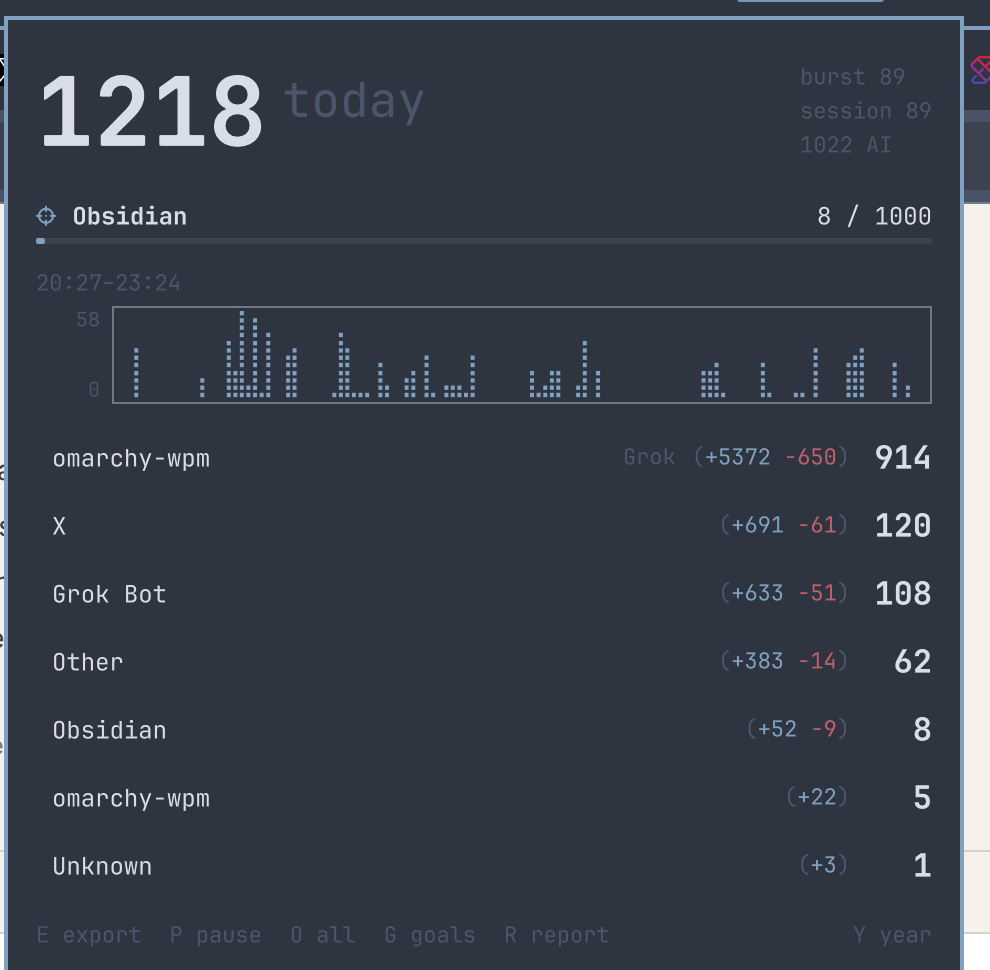

# Words for Omarchy

Live words-per-minute from **actual keyboard input**, attributed to the
active Hyprland window. Git-style `+insertions −deletions` per app, a
daily Obsidian word goal, SQLite history, Markdown export into a daily
note, and a GitHub-style year graph in the panel.

It never stores the text you type — only counts.



## Install

```sh
omarchy plugin add https://github.com/jandragsbaek/omarchy-words.git --enable --yes
```

The widget lands on the right of the bar. Move it with `omarchy bar move jandragsbaek.words`.

## Keyboard access

The daemon reads `/dev/input` (evdev). Your user must be in the `input` group:

```sh
sudo usermod -aG input $USER
```

Then log out and back in. Until that is done, the bar shows setup.

**Honest limit:** the `input` group is still keylogger-level at the OS.
Any other process running as you can open `/dev/input`. This plugin cannot
take that permission away.

**What this plugin does with keys:** a filter maps each scancode to
letter / space / punct / delete, then forgets the scancode. Nothing in
the daemon, status JSON, or SQLite stores characters, key names, titles,
or sequences. Window titles are used only in memory to match a herdr
workspace label or an allowlisted browser site (`x`, `github`, …), then
dropped. Full tab titles (search queries, tweet text) are never stored.
Shortcuts with Ctrl/Alt/Super are ignored.

## What it counts

| Metric | Rule |
|---|---|
| Live / burst / session WPM | Net characters ÷ 5 ÷ minutes (typing-test standard). A burst ends after 1.5s idle. |
| Daily goal words | Space-separated letter-runs, net of backspace. Default goal: **1000 words in `obsidian`**. |
| Git diffs | `+` printable keys, `−` backspaces. Raw characters, not reconstructed words. |
| Activity | If the focused window hosts **herdr**, words go to `agent · workspace` (e.g. `grok · grok build`) from herdr's snapshot. Titles are not stored. |
| Browser site | Chromium (and Firefox/Brave/Chrome) titles are classified to an allowlisted slug (`x`, `github`, `google`, …). Activity becomes `chromium · x`. The rest of the tab title is dropped. |
| Herdr / Hyprland workspaces | Separate per-workspace totals for herdr labels and Hyprland workspace names. |
| Shortcuts | Ignored while Ctrl, Alt, or Super are held. Shift still counts as typing. |
| Lock screen | Counting pauses while the session looks locked. |

Right-click the bar chip to pause or resume. Middle-click exports today's Markdown.

## Panel

Click the chip. The hero is today's word count; burst and session WPM sit on
the right. Live WPM stays on the bar chip. Combined spark for the day, up to
ten activity rows (click to solo).
**Y** opens the GitHub-style year chart. **O** opens today's full list; **R**
opens week/month/year/all. Keys:

| Key | Action |
|---|---|
| `Y` | Expand / collapse the year frequency chart |
| `O` | Open today's full list in a browser tab |
| `G` | Open goals (read-only). Click a goal to edit it. Accept saves; `G` / Esc leaves. |
| `R` | Open week / month / year / all report in a browser tab |
| `E` | Export today's Markdown |
| `P` | Pause / resume |
| `Esc` | Close |

## Settings

Omarchy convention: widget settings live on the bar entry in
`~/.config/omarchy/shell.json`, declared as `barWidget.schema` in the
manifest. The widget settings UI and `omarchy bar set` both write that
entry. Numbers need `--json` so they stay numbers:

```sh
omarchy bar set jandragsbaek.words goalWords 1000 --json
omarchy bar set jandragsbaek.words goalMatch obsidian
```

`goalMatch` can be:

| Match | Counts |
|---|---|
| `obsidian` | Hyprland class, or a herdr workspace / activity of the same name |
| `class:obsidian` | Only that window class |
| `site:x` | Typed in a browser tab classified as X (also `site:twitter`) |
| `herdr:grok build` | That herdr workspace |
| `activity:grok · grok build` | That inferred activity |
| `ws:2` | Hyprland workspace `2` |
| `all` | Everything |

Several goals at once (same pattern as nested JSON on first-party widgets):

```sh
omarchy bar set jandragsbaek.words goals '[
  {"match":"obsidian","words":1000,"label":"Obsidian"},
  {"match":"site:x","words":500,"label":"X"},
  {"match":"herdr:grok build","words":200,"label":"Grok Build"}
]' --json
```

When `goals` is set, it is the full list. The bar chip uses the first one.

## Daily note

Set **Daily note path** in the widget settings, for example:

```
~/vault/Daily/{yyyy}-{MM}-{dd}.md
```

Tokens: `{date}`, `{yyyy}`, `{MM}`, `{dd}`, `{yyyy-MM-dd}`.

Turn on **Update daily note** to rewrite a marked section as you type, or
export on demand:

```sh
omawpm export --note ~/vault/Daily/{date}.md
omawpm export --stdout
```

The plugin owns only this block, and will not touch the rest of the note:

```markdown
<!-- omawpm:start -->
## Writing — 2026-08-28
...
<!-- omawpm:end -->
```

## Data

- SQLite: `~/.local/state/omarchy/plugins/jandragsbaek.words/wpm.sqlite`
  (a previous `jan.wpm` database is copied here on first launch)
- Config: `~/.config/omarchy/omawpm.json`
- Live status: `$XDG_RUNTIME_DIR/omawpm/status.json` (mode 0600)

```sh
omawpm status
omawpm config goalWords 1000
omawpm config goalAppClass obsidian
omawpm pause
omawpm resume
```

## Privacy

Persisted rows are day + window class + empty title + numeric totals, plus
activity / site / workspace slices. No keycodes, no timestamps per key, no
document text, no full tab titles.

Browser attribution uses the Hyprland window title (Chromium sets it to the
active tab) and keeps only an allowlisted slug. Unknown pages stay
`chromium`. There is no Chromium DevTools / CDP attachment — that would
need `--remote-debugging-port` and would see URLs and page content.

## Development

Work in this repo (`~/src/omarchy-wpm`). Do **not** rsync or copy the tree
into `~/.config/omarchy/plugins/jandragsbaek.words` while `omarchy-shell` is running.
Each write retriggers a plugin reload; Omarchy tears down every service
including the lock, and Quickshell can abort (Omarchy #7106 / #8647).
`qmllint` complaining about `function exportNote(): void` on `IpcHandler`
is a false alarm.

```sh
PYTHONPATH=. python3 -m unittest discover -s tests -v
omarchy plugin validate .
```

To install a local build, pause the shell first, then:

```sh
./scripts/install-local.sh
omarchy restart shell
```

Or one shot (stops the shell, replaces the plugin directory, starts it):

```sh
./scripts/install-local.sh --after-shell-restart
```

The counting core is stdlib Python (no `python-evdev`). The shell plugin
is Quickshell QML and follows the active Omarchy theme (`Color` / `Style`).
